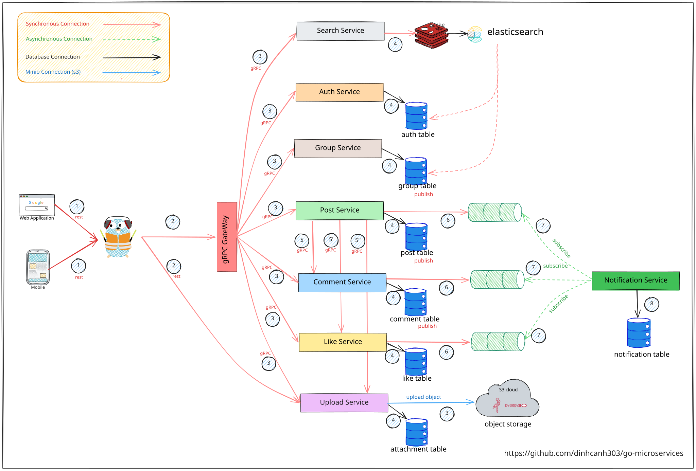
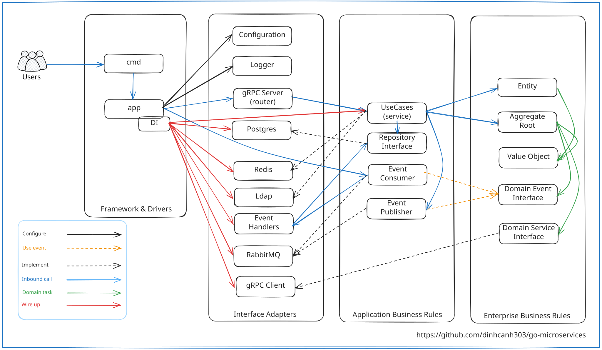

# go-microservices

An event-driven microservices social application has been written in Golang 
## Technical stack
- Infrastructure
    - PostgreSQL
    - RabbitMQ
    - Docker and Docker-compose
    - Minio
    - Redis
## Design

## Services
No. | Service | URL
--- | ---- | -----
1 | gRPC Gateway | [http://localhost:5000](http://localhost:5000)
2 | Group Service | [http://localhost:5001](http://localhost:5001)
3 | Post Service | [http://localhost:5002](http://localhost:5002)
4 | Comment Service | [http://localhost:5003](http://localhost:5003)
5 | Like Service | [http://localhost:5004](http://localhost:5004)
6 | Upload Service | [http://localhost:5005](http://localhost:5005)<br>[http://localhost:5006](http://localhost:5006)
7 | Auth Service | [http://localhost:5007](http://localhost:5007)
8 | Notification Service | worker only
9 | Web | loading...
## Clean Architecture

### Explain Clean Architecture
- Clean Architecture is a multi-layered architecture.
- Isolate Business Rules. Similar to Hexagonal and Onion architecture.
- The concentric circles represent layers, the closer to the center 
the more abstract (high level), and the further out the more detailed (low level).
- Dependency Inversion (DI) in SOLID
    High level will not depend on low level, both depend on abstraction/interface.
    Abstraction does not depend on details but vice versa.
#### Note 
- ---> In Clean Architecture arrows is Dependency Direction , not call direction.
## Clean Domain-driven Design


## Development

### Generate dependency injection instances with wire
- [Compile-time Dependency Injection for Go of Google](https://github.com/google/wire)
```bash
> make wire
```
### Generate code with sqlc
- [Generate type-safe code from SQL](https://docs.sqlc.dev/en/stable/index.html)
```bash
> make sqlc
```
### Generate proto using protobuf 
- [Go support for Google's protocol buffers](https://github.com/golang/protobuf)
```bash
> make proto-gen
```
## Start go-microservices
### Start docker core include (postgres , redis, rabbitmq, etc)
```bash
> make docker-compose-core
```
### Start docker multi-service (group,post,like, etc)
```bash
> make docker-compose
```
### Start service traefik 
- [The Cloud Native Application Proxy](https://github.com/traefik/traefik)
```bash
> cd traefik -> make docker-compose
```


