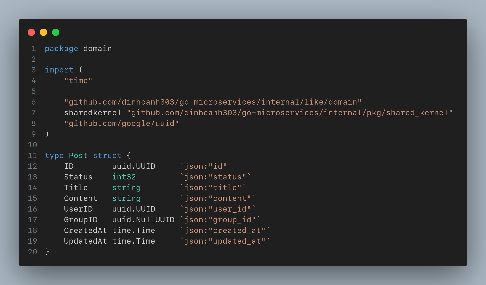
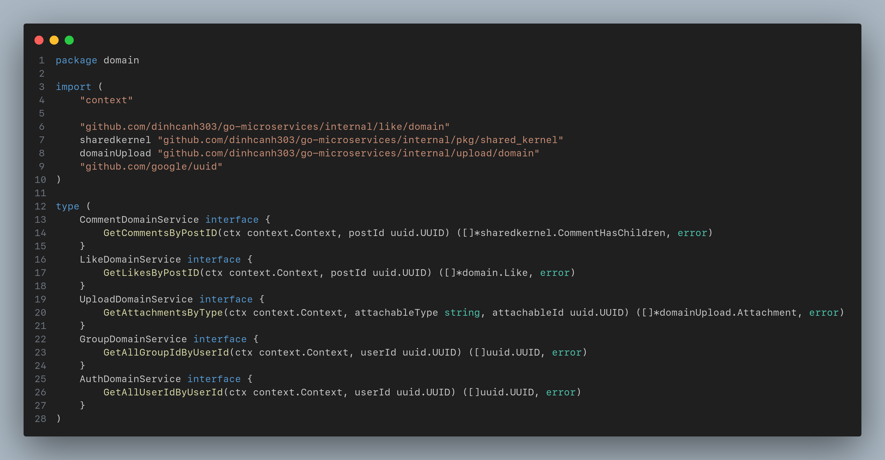
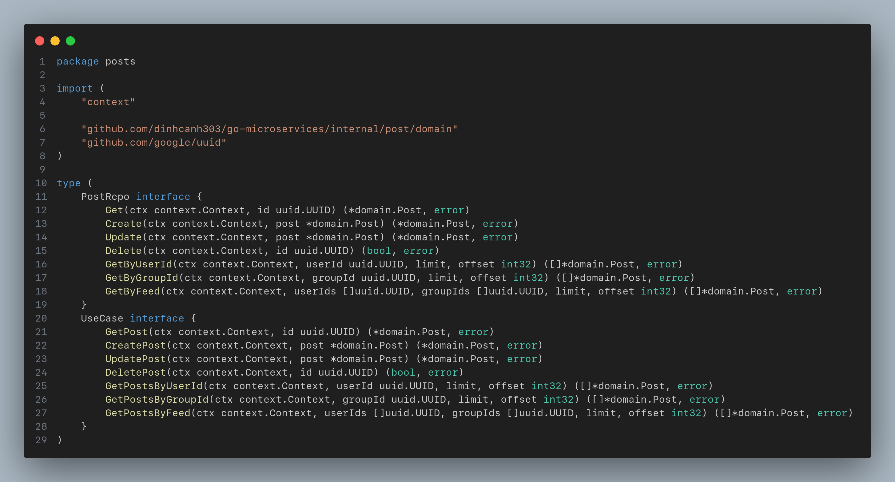
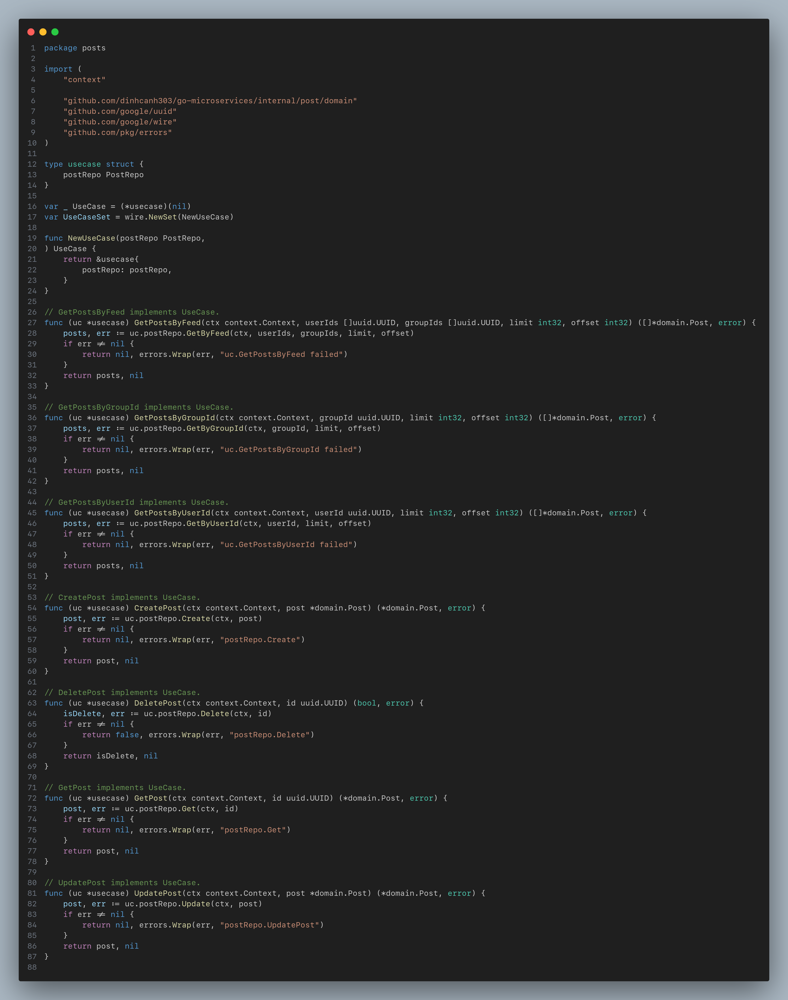
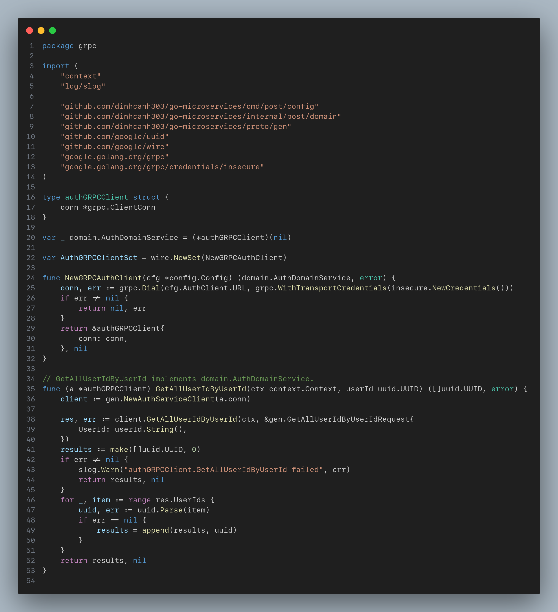
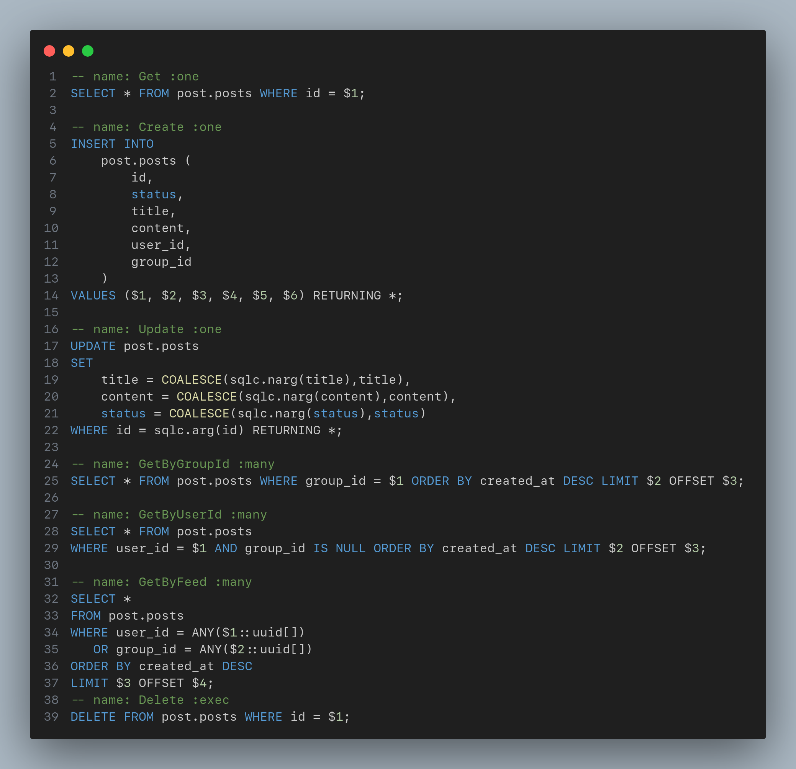
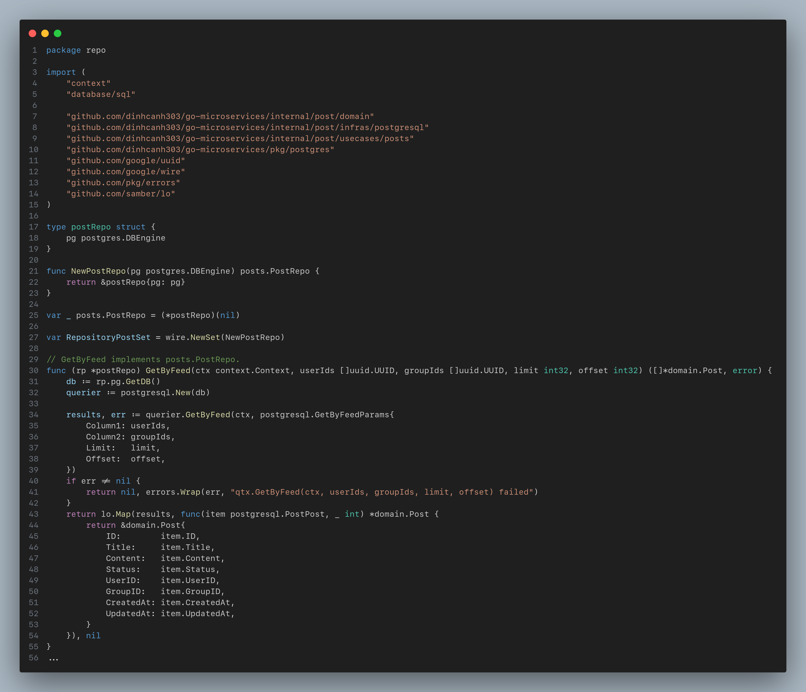
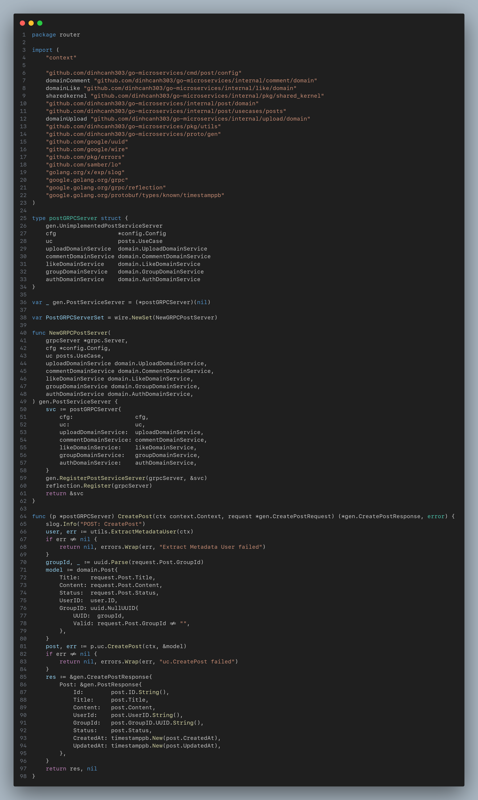
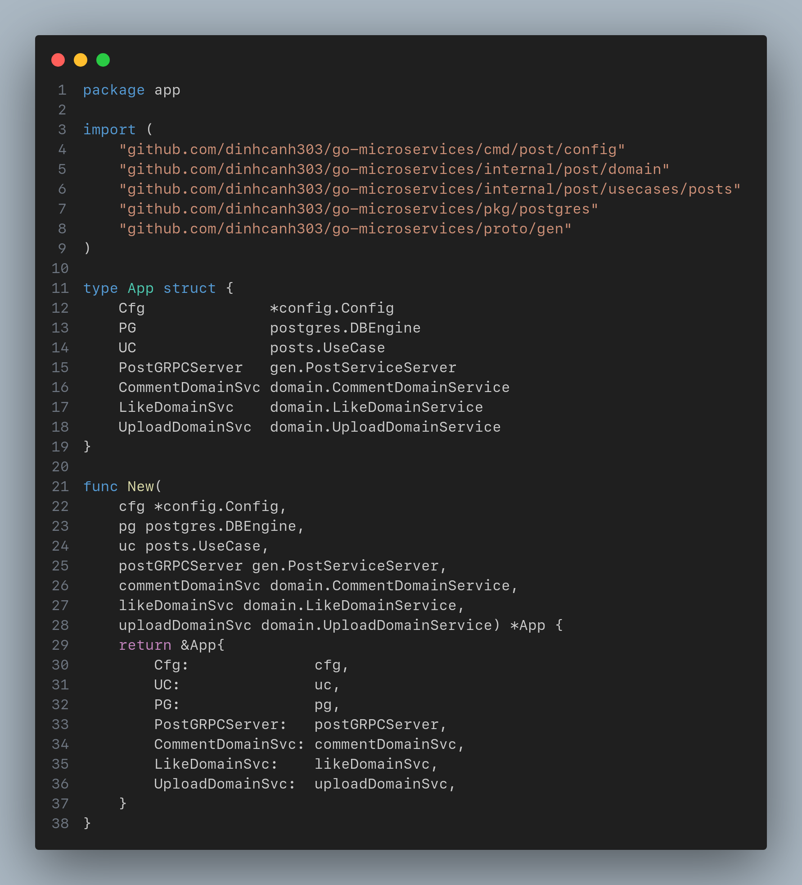
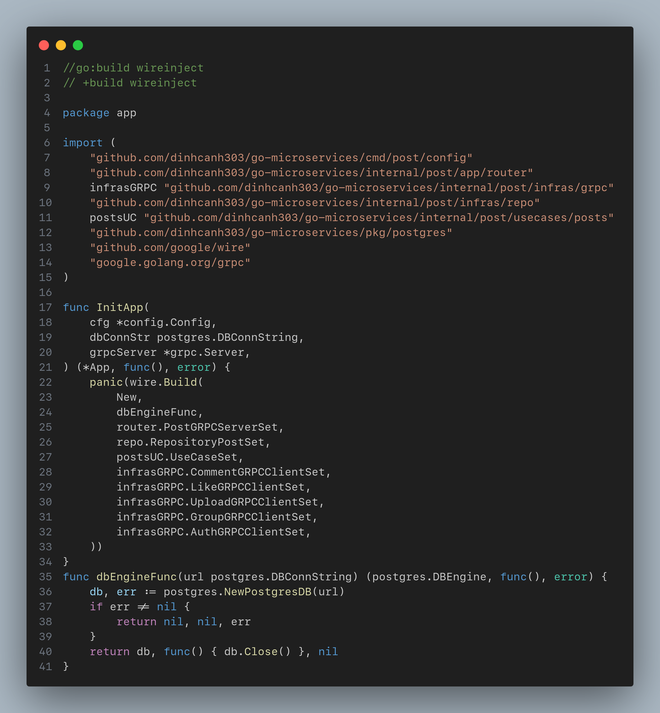

# Step By Step create service:


## DDD and Clean Architecture

### Folder structure
Let's focus on directories in [`/internal`](../internal/)
```
internal
├── auth
│   ├── app
│   ├── domain
│   ├── infras
│   └── usecases
├── group
│   ├── app
│   ├── domain
│   ├── infras
│   └── usecases
└── post
    ├── app
    ├── domain
    ├── infras
    └── usecases
...
```
### Example create service post 
```bash
> cd internal 
> mkdir post
> create folder domain
                infras
                usecases
                app
```
### 1.Enterprise Business Rules
#### Domain 
- Contains domain models.This is the heart of the system, containing entities, states, and business logic.
##### Entity
- Represents the core business objects.<br>

##### Interfaces
- Defines contracts for interactions within the domain (Domain Service Interface).<br>

### 2.Application Business Rules
#### UseCase

##### Interfaces

###### Repository Interface
- Repository Interface is defines methods for data access in the domain. 
###### UseCase Interface
- UseCase Interface is defines methods representing use cases.
##### Service (UseCase)
- Implements the use case interfaces.<br>


### 3.Interface Adapter
#### Infrastructure

##### gRPC
- Implements external interface like gRPC clients.
- Example Auth client.<br>

...
##### Postgresql
- Create file query.sql
- Utilizes SQLC for generating go code from SQL queries.
- Example: `query.sql` for defining queries.<br>

- SQLC generation using the `make sqlc` command:
```bash
> make sqlc 
```
- Generated files:db.go,models.go and query.sql.go.<br>

##### Repository
- Implements repository interface for data access.<br>

### 4.Framework and Drivers
#### Application
##### Router
- Using gRPC server (router) for handling inbound call UseCase (service) and Domain Service Interface.<br> 

##### App
- Contains the main application logic and wiring.<br>

##### Wire (Dependency Injection (DI) of Google)
- Utilizes Google Wire for dependency injection.<br>

```bash
> make wire
```
### Cmd


