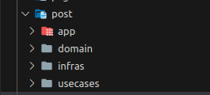

# Step By Step create service:


## DDD and Clean Architecture
### Example create service post 
```bash
> cd internal 
> mkdir post
> create folder domain
                infras
                usecases
                app
```

### 1.Enterprise Business Rules
#### Domain 
- Contains domain models.This is the heart of the system, containing entities, states, and business logic.
##### Entity

##### Interfaces

### 2.Application Business Rules
#### UseCase

##### Interfaces

###### Repository Interface
- Repository Interface 
###### UseCase Interface
- UseCase Interface 
##### Service (UseCase)


### 3.Interface Adapter
#### Infrastructure

##### gRPC
- Example Auth client 

...
##### Postgresql
- Create file query.sql written query sql using syntax sqlc support

- Then using command:
```bash
> make sqlc 
```

- sqlc generation multi file (db.go,models.go and query.sql.go)
##### Repo


