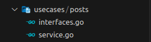
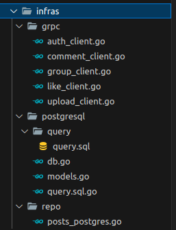
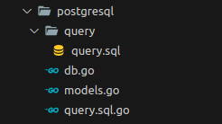

# Step By Step create service:


## DDD and Clean Architecture

### Folder structure
Let's focus on directories in [`/internal`](../internal/)
```
internal
├── auth
│   ├── app
│   ├── domain
│   ├── infras
│   └── usecases
├── group
│   ├── app
│   ├── domain
│   ├── infras
│   └── usecases
└── post
    ├── app
    ├── domain
    ├── infras
    └── usecases
...
```
### Example create service post 
```bash
> cd internal 
> mkdir post
> create folder domain
                infras
                usecases
                app
```
### 1.Enterprise Business Rules
#### Domain 
Contains domain models.This is the heart of the system, containing entities, states, and business logic.
##### Entity
Represents the core business objects.<br>
```go
package domain

import (
	"time"

	"github.com/dinhcanh303/go-microservices/internal/like/domain"
	sharedkernel "github.com/dinhcanh303/go-microservices/internal/pkg/shared_kernel"
	"github.com/google/uuid"
)

type Post struct {
	ID        uuid.UUID     `json:"id"`
	Status    int32         `json:"status"`
	Title     string        `json:"title"`
	Content   string        `json:"content"`
	UserID    uuid.UUID     `json:"user_id"`
	GroupID   uuid.NullUUID `json:"group_id"`
	CreatedAt time.Time     `json:"created_at"`
	UpdatedAt time.Time     `json:"updated_at"`
}
```
##### Interfaces
Defines contracts for interactions within the domain (Domain Service Interface).<br>
```go
package domain

import (
	"context"

	"github.com/dinhcanh303/go-microservices/internal/like/domain"
	sharedkernel "github.com/dinhcanh303/go-microservices/internal/pkg/shared_kernel"
	domainUpload "github.com/dinhcanh303/go-microservices/internal/upload/domain"
	"github.com/google/uuid"
)

type (
	CommentDomainService interface {
		GetCommentsByPostID(ctx context.Context, postId uuid.UUID) ([]*sharedkernel.CommentHasChildren, error)
	}
	LikeDomainService interface {
		GetLikesByPostID(ctx context.Context, postId uuid.UUID) ([]*domain.Like, error)
	}
	UploadDomainService interface {
		GetAttachmentsByType(ctx context.Context, attachableType string, attachableId uuid.UUID) ([]*domainUpload.Attachment, error)
	}
	GroupDomainService interface {
		GetAllGroupIdByUserId(ctx context.Context, userId uuid.UUID) ([]uuid.UUID, error)
	}
	AuthDomainService interface {
		GetAllUserIdByUserId(ctx context.Context, userId uuid.UUID) ([]uuid.UUID, error)
	}
)
```
### 2.Application Business Rules
#### UseCase


##### Interfaces
```go
package posts

import (
	"context"

	"github.com/dinhcanh303/go-microservices/internal/post/domain"
	"github.com/google/uuid"
)

type (
	PostRepo interface {
		Get(ctx context.Context, id uuid.UUID) (*domain.Post, error)
		Create(ctx context.Context, post *domain.Post) (*domain.Post, error)
		Update(ctx context.Context, post *domain.Post) (*domain.Post, error)
		Delete(ctx context.Context, id uuid.UUID) (bool, error)
		GetByUserId(ctx context.Context, userId uuid.UUID, limit, offset int32) ([]*domain.Post, error)
		GetByGroupId(ctx context.Context, groupId uuid.UUID, limit, offset int32) ([]*domain.Post, error)
		GetByFeed(ctx context.Context, userIds []uuid.UUID, groupIds []uuid.UUID, limit, offset int32) ([]*domain.Post, error)
	}
	UseCase interface {
		GetPost(ctx context.Context, id uuid.UUID) (*domain.Post, error)
		CreatePost(ctx context.Context, post *domain.Post) (*domain.Post, error)
		UpdatePost(ctx context.Context, post *domain.Post) (*domain.Post, error)
		DeletePost(ctx context.Context, id uuid.UUID) (bool, error)
		GetPostsByUserId(ctx context.Context, userId uuid.UUID, limit, offset int32) ([]*domain.Post, error)
		GetPostsByGroupId(ctx context.Context, groupId uuid.UUID, limit, offset int32) ([]*domain.Post, error)
		GetPostsByFeed(ctx context.Context, userIds []uuid.UUID, groupIds []uuid.UUID, limit, offset int32) ([]*domain.Post, error)
	}
)
```
###### Repository Interface
Repository Interface is defines methods for data access in the domain. 
###### UseCase Interface
UseCase Interface is defines methods representing use cases.
##### Service (UseCase)
Implements the use case interfaces.<br>
```go
package posts

import (
	"context"

	"github.com/dinhcanh303/go-microservices/internal/post/domain"
	"github.com/google/uuid"
	"github.com/google/wire"
	"github.com/pkg/errors"
)

type usecase struct {
	postRepo PostRepo
}

var _ UseCase = (*usecase)(nil)
var UseCaseSet = wire.NewSet(NewUseCase)

func NewUseCase(postRepo PostRepo,
) UseCase {
	return &usecase{
		postRepo: postRepo,
	}
}

// GetPostsByFeed implements UseCase.
func (uc *usecase) GetPostsByFeed(ctx context.Context, userIds []uuid.UUID, groupIds []uuid.UUID, limit int32, offset int32) ([]*domain.Post, error) {
	posts, err := uc.postRepo.GetByFeed(ctx, userIds, groupIds, limit, offset)
	if err != nil {
		return nil, errors.Wrap(err, "uc.GetPostsByFeed failed")
	}
	return posts, nil
}

// GetPostsByGroupId implements UseCase.
func (uc *usecase) GetPostsByGroupId(ctx context.Context, groupId uuid.UUID, limit int32, offset int32) ([]*domain.Post, error) {
	posts, err := uc.postRepo.GetByGroupId(ctx, groupId, limit, offset)
	if err != nil {
		return nil, errors.Wrap(err, "uc.GetPostsByGroupId failed")
	}
	return posts, nil
}
...
```
### 3.Interface Adapter
#### Infrastructure

##### gRPC
Implements external interface like gRPC clients.
Example Auth client.<br>
```go
package grpc

import (
	"context"
	"log/slog"

	"github.com/dinhcanh303/go-microservices/cmd/post/config"
	"github.com/dinhcanh303/go-microservices/internal/post/domain"
	"github.com/dinhcanh303/go-microservices/proto/gen"
	"github.com/google/uuid"
	"github.com/google/wire"
	"google.golang.org/grpc"
	"google.golang.org/grpc/credentials/insecure"
)

type authGRPCClient struct {
	conn *grpc.ClientConn
}

var _ domain.AuthDomainService = (*authGRPCClient)(nil)

var AuthGRPCClientSet = wire.NewSet(NewGRPCAuthClient)

func NewGRPCAuthClient(cfg *config.Config) (domain.AuthDomainService, error) {
	conn, err := grpc.Dial(cfg.AuthClient.URL, grpc.WithTransportCredentials(insecure.NewCredentials()))
	if err != nil {
		return nil, err
	}
	return &authGRPCClient{
		conn: conn,
	}, nil
}

// GetAllUserIdByUserId implements domain.AuthDomainService.
func (a *authGRPCClient) GetAllUserIdByUserId(ctx context.Context, userId uuid.UUID) ([]uuid.UUID, error) {
	client := gen.NewAuthServiceClient(a.conn)

	res, err := client.GetAllUserIdByUserId(ctx, &gen.GetAllUserIdByUserIdRequest{
		UserId: userId.String(),
	})
	results := make([]uuid.UUID, 0)
	if err != nil {
		slog.Warn("authGRPCClient.GetAllUserIdByUserId failed", err)
		return results, nil
	}
	for _, item := range res.UserIds {
		uuid, err := uuid.Parse(item)
		if err == nil {
			results = append(results, uuid)
		}
	}
	return results, nil
}
```
##### Postgresql
Create file query.sql
Utilizes SQLC for generating go code from SQL queries.
Example: `query.sql` for defining queries.<br>
```sql
-- name: Get :one
SELECT * FROM post.posts WHERE id = $1;

-- name: Create :one
INSERT INTO
    post.posts (
        id,
        status,
        title,
        content,
        user_id,
        group_id
    )
VALUES ($1, $2, $3, $4, $5, $6) RETURNING *;

-- name: Update :one
UPDATE post.posts 
SET
    title = COALESCE(sqlc.narg(title),title),
    content = COALESCE(sqlc.narg(content),content),
    status = COALESCE(sqlc.narg(status),status)
WHERE id = sqlc.arg(id) RETURNING *;

-- name: GetByGroupId :many
SELECT * FROM post.posts WHERE group_id = $1 ORDER BY created_at DESC LIMIT $2 OFFSET $3;

-- name: GetByUserId :many
SELECT * FROM post.posts 
WHERE user_id = $1 AND group_id IS NULL ORDER BY created_at DESC LIMIT $2 OFFSET $3;

-- name: GetByFeed :many
SELECT *
FROM post.posts
WHERE user_id = ANY($1::uuid[])
   OR group_id = ANY($2::uuid[])
ORDER BY created_at DESC
LIMIT $3 OFFSET $4;
-- name: Delete :exec
DELETE FROM post.posts WHERE id = $1;
```
SQLC generation using the `make sqlc` command:
```bash
> make sqlc 
```
Generated files:db.go,models.go and query.sql.go.<br>

##### Repository
Implements repository interface for data access.<br>
```go
package repo

import (
	"context"
	"database/sql"

	"github.com/dinhcanh303/go-microservices/internal/post/domain"
	"github.com/dinhcanh303/go-microservices/internal/post/infras/postgresql"
	"github.com/dinhcanh303/go-microservices/internal/post/usecases/posts"
	"github.com/dinhcanh303/go-microservices/pkg/postgres"
	"github.com/google/uuid"
	"github.com/google/wire"
	"github.com/pkg/errors"
	"github.com/samber/lo"
)

type postRepo struct {
	pg postgres.DBEngine
}

func NewPostRepo(pg postgres.DBEngine) posts.PostRepo {
	return &postRepo{pg: pg}
}

var _ posts.PostRepo = (*postRepo)(nil)

var RepositoryPostSet = wire.NewSet(NewPostRepo)

// GetByFeed implements posts.PostRepo.
func (rp *postRepo) GetByFeed(ctx context.Context, userIds []uuid.UUID, groupIds []uuid.UUID, limit int32, offset int32) ([]*domain.Post, error) {
	db := rp.pg.GetDB()
	querier := postgresql.New(db)

	results, err := querier.GetByFeed(ctx, postgresql.GetByFeedParams{
		Column1: userIds,
		Column2: groupIds,
		Limit:   limit,
		Offset:  offset,
	})
	if err != nil {
		return nil, errors.Wrap(err, "qtx.GetByFeed(ctx, userIds, groupIds, limit, offset) failed")
	}
	return lo.Map(results, func(item postgresql.PostPost, _ int) *domain.Post {
		return &domain.Post{
			ID:        item.ID,
			Title:     item.Title,
			Content:   item.Content,
			Status:    item.Status,
			UserID:    item.UserID,
			GroupID:   item.GroupID,
			CreatedAt: item.CreatedAt,
			UpdatedAt: item.UpdatedAt,
		}
	}), nil
}
...
```
### 4.Framework and Drivers
#### Application
##### Router
Using gRPC server (router) for handling inbound call UseCase (service) and Domain Service Interface.<br> 
```go
package router

import (
	"context"

	"github.com/dinhcanh303/go-microservices/cmd/post/config"
	domainComment "github.com/dinhcanh303/go-microservices/internal/comment/domain"
	domainLike "github.com/dinhcanh303/go-microservices/internal/like/domain"
	sharedkernel "github.com/dinhcanh303/go-microservices/internal/pkg/shared_kernel"
	"github.com/dinhcanh303/go-microservices/internal/post/domain"
	"github.com/dinhcanh303/go-microservices/internal/post/usecases/posts"
	domainUpload "github.com/dinhcanh303/go-microservices/internal/upload/domain"
	"github.com/dinhcanh303/go-microservices/pkg/utils"
	"github.com/dinhcanh303/go-microservices/proto/gen"
	"github.com/google/uuid"
	"github.com/google/wire"
	"github.com/pkg/errors"
	"github.com/samber/lo"
	"golang.org/x/exp/slog"
	"google.golang.org/grpc"
	"google.golang.org/grpc/reflection"
	"google.golang.org/protobuf/types/known/timestamppb"
)

type postGRPCServer struct {
	gen.UnimplementedPostServiceServer
	cfg                  *config.Config
	uc                   posts.UseCase
	uploadDomainService  domain.UploadDomainService
	commentDomainService domain.CommentDomainService
	likeDomainService    domain.LikeDomainService
	groupDomainService   domain.GroupDomainService
	authDomainService    domain.AuthDomainService
}

var _ gen.PostServiceServer = (*postGRPCServer)(nil)

var PostGRPCServerSet = wire.NewSet(NewGRPCPostServer)

func NewGRPCPostServer(
	grpcServer *grpc.Server,
	cfg *config.Config,
	uc posts.UseCase,
	uploadDomainService domain.UploadDomainService,
	commentDomainService domain.CommentDomainService,
	likeDomainService domain.LikeDomainService,
	groupDomainService domain.GroupDomainService,
	authDomainService domain.AuthDomainService,
) gen.PostServiceServer {
	svc := postGRPCServer{
		cfg:                  cfg,
		uc:                   uc,
		uploadDomainService:  uploadDomainService,
		commentDomainService: commentDomainService,
		likeDomainService:    likeDomainService,
		groupDomainService:   groupDomainService,
		authDomainService:    authDomainService,
	}
	gen.RegisterPostServiceServer(grpcServer, &svc)
	reflection.Register(grpcServer)
	return &svc
}

func (p *postGRPCServer) CreatePost(ctx context.Context, request *gen.CreatePostRequest) (*gen.CreatePostResponse, error) {
	slog.Info("POST: CreatePost")
	user, err := utils.ExtractMetadataUser(ctx)
	if err != nil {
		return nil, errors.Wrap(err, "Extract Metadata User failed")
	}
	groupId, _ := uuid.Parse(request.Post.GroupId)
	model := domain.Post{
		Title:   request.Post.Title,
		Content: request.Post.Content,
		Status:  request.Post.Status,
		UserID:  user.ID,
		GroupID: uuid.NullUUID{
			UUID:  groupId,
			Valid: request.Post.GroupId != "",
		},
	}
	post, err := p.uc.CreatePost(ctx, &model)
	if err != nil {
		return nil, errors.Wrap(err, "uc.CreatePost failed")
	}
	res := &gen.CreatePostResponse{
		Post: &gen.PostResponse{
			Id:        post.ID.String(),
			Title:     post.Title,
			Content:   post.Content,
			UserId:    post.UserID.String(),
			GroupId:   post.GroupID.UUID.String(),
			Status:    post.Status,
			CreatedAt: timestamppb.New(post.CreatedAt),
			UpdatedAt: timestamppb.New(post.UpdatedAt),
		},
	}
	return res, nil
}
...
```
##### App
Contains the main application logic and wiring.<br>
```go
package app

import (
	"github.com/dinhcanh303/go-microservices/cmd/post/config"
	"github.com/dinhcanh303/go-microservices/internal/post/domain"
	"github.com/dinhcanh303/go-microservices/internal/post/usecases/posts"
	"github.com/dinhcanh303/go-microservices/pkg/postgres"
	"github.com/dinhcanh303/go-microservices/proto/gen"
)

type App struct {
	Cfg              *config.Config
	PG               postgres.DBEngine
	UC               posts.UseCase
	PostGRPCServer   gen.PostServiceServer
	CommentDomainSvc domain.CommentDomainService
	LikeDomainSvc    domain.LikeDomainService
	UploadDomainSvc  domain.UploadDomainService
}

func New(
	cfg *config.Config,
	pg postgres.DBEngine,
	uc posts.UseCase,
	postGRPCServer gen.PostServiceServer,
	commentDomainSvc domain.CommentDomainService,
	likeDomainSvc domain.LikeDomainService,
	uploadDomainSvc domain.UploadDomainService) *App {
	return &App{
		Cfg:              cfg,
		UC:               uc,
		PG:               pg,
		PostGRPCServer:   postGRPCServer,
		CommentDomainSvc: commentDomainSvc,
		LikeDomainSvc:    likeDomainSvc,
		UploadDomainSvc:  uploadDomainSvc,
	}
}
```
##### Wire (Dependency Injection (DI) of Google)
Utilizes Google Wire for dependency injection.<br>
```go
//go:build wireinject
// +build wireinject

package app

import (
	"github.com/dinhcanh303/go-microservices/cmd/post/config"
	"github.com/dinhcanh303/go-microservices/internal/post/app/router"
	infrasGRPC "github.com/dinhcanh303/go-microservices/internal/post/infras/grpc"
	"github.com/dinhcanh303/go-microservices/internal/post/infras/repo"
	postsUC "github.com/dinhcanh303/go-microservices/internal/post/usecases/posts"
	"github.com/dinhcanh303/go-microservices/pkg/postgres"
	"github.com/google/wire"
	"google.golang.org/grpc"
)

func InitApp(
	cfg *config.Config,
	dbConnStr postgres.DBConnString,
	grpcServer *grpc.Server,
) (*App, func(), error) {
	panic(wire.Build(
		New,
		dbEngineFunc,
		router.PostGRPCServerSet,
		repo.RepositoryPostSet,
		postsUC.UseCaseSet,
		infrasGRPC.CommentGRPCClientSet,
		infrasGRPC.LikeGRPCClientSet,
		infrasGRPC.UploadGRPCClientSet,
		infrasGRPC.GroupGRPCClientSet,
		infrasGRPC.AuthGRPCClientSet,
	))
}
func dbEngineFunc(url postgres.DBConnString) (postgres.DBEngine, func(), error) {
	db, err := postgres.NewPostgresDB(url)
	if err != nil {
		return nil, nil, err
	}
	return db, func() { db.Close() }, nil
}
```
Then using wire generation file `wire_gen.go` (file code gen dependency injection).
```bash
> make wire
```
### Cmd


